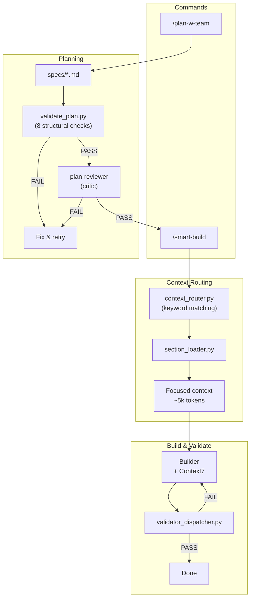

# qwen-code-autocode-flow

[](https://github.com/a-simeshin/qwen-code-autocode-flow/blob/main/README.md)
[](https://github.com/a-simeshin/qwen-code-autocode-flow/blob/main/README.ru.md)
[](https://qwen.ai)
[](https://opensource.org/licenses/MIT)

> Multi-agent automation framework for **Qwen Code** — ported from [claude-code-hooks-mastery](https://github.com/a-simeshin/claude-code-hooks-mastery).

Make Qwen Code agent work **independently and consistently** — you describe a task, Qwen Code delivers a quality result that matches your expectations.

### Principles

1. **Automate every action** — if an action exists, it's automated via LLM (planning, review, validation, knowledge recording)
2. **Control via deterministic scripts** — all actions are governed by hard scripts, not LLM discretion (validators, routers, dispatchers)
3. **Never delete files** — destructive operations are prohibited; hooks enforce this at the system level
4. **Document into project memory** — decisions and outcomes are recorded into long-term project-level memory (Serena)
5. **Strict format validation** — plan structure and documentation format are verified by structural validators before execution
6. **Stack-aware coding standards** — code and test conventions are loaded into agents dynamically by scripts based on the detected technology stack

## Quick Start

```bash
curl -fsSL https://raw.githubusercontent.com/a-simeshin/qwen-code-autocode-flow/main/install.sh | bash
```

Installs `.qwen/` directory with refs, agents, hooks, and validators into the current project.

**Prerequisites:** Qwen Code, [Astral UV](https://docs.astral.sh/uv/) (auto-installed), Node.js, Git

```bash
# Non-interactive install (for CI/automation)
NONINTERACTIVE=1 bash install.sh

# Uninstall (remove .qwen directory)
rm -rf .qwen
```

## Architecture



## Features

| Feature | What it does | Docs |
|---------|-------------|------|
| **Context Routing** | Keyword-based section routing — loads only relevant refs per task, zero LLM cost | [docs/context-routing.md](docs/context-routing.md) |
| **Plan With Team** | Two-round interview + Section Routing Catalog + Testing Strategy + 8-check validation | [docs/plan-w-team.md](docs/plan-w-team.md) |
| **Testing Strategy** | Enforced 80/15/5 test pyramid (unit / integration-API / UI e2e), dedicated `write-tests` task | [docs/testing-strategy.md](docs/testing-strategy.md) |
| **Plan Review** | Two-stage gate before build: structural validator + 8-criteria critic | [docs/plan-review.md](docs/plan-review.md) |
| **Context7** | Optional live documentation lookup for any library via MCP | [docs/context7.md](docs/context7.md) |
| **Serena** | Optional semantic code navigation via LSP — symbol search, references, type hierarchy | [docs/serena.md](docs/serena.md) |
| **Validators** | Smart dispatcher runs matching validators per file extension (Java/React/Python) | [docs/validators.md](docs/validators.md) |
| **Status Line** | Context bar, usage limits, tool/agent tracking | [docs/status-line.md](docs/status-line.md) |
| **Install** | One-line `curl` install + non-interactive mode for CI | [docs/install.md](docs/install.md) |

## Commands

| Command | Description |
|---------|-------------|
| `/plan-w-team` | Create a plan with interviews, review gate |
| `/smart-build` | Build with context routing and validation |
| `/plan` | Quick single-agent implementation plan |
| `/all-tools` | List all available tools |

## Directory Structure

```
.qwen/
  hooks/              # Python hook scripts for lifecycle events
    validators/       # 15 file-type-specific validators
    utils/llm/        # LLM client wrappers
  agents/             # Agent configurations
    team/             # builder, validator, plan-reviewer
  skills/             # Slash command definitions
  refs/               # Coding standards (Java, React, Python)
  output-styles/      # Output format templates
  settings.json       # Hook and agent configuration
specs/                # Implementation plans
logs/                 # Execution logs
```

## MCP Integrations (Optional)

### [Context7](https://github.com/upstash/context7)

Live documentation lookup for any library. When available, builder and validator agents query Context7 before implementation to get current API references instead of relying on training data. Covers Spring Boot, React, FastAPI, and any other library. If not configured, agents fall back to refs and training data.

### [Serena](https://github.com/oraios/serena)

Semantic code intelligence via Language Server Protocol. When available, all agents prefer Serena's symbol-level navigation (`find_symbol`, `get_symbols_overview`, `find_referencing_symbols`) over Glob/Grep for code exploration. Plan_w_team also uses Serena's `write_memory` / `read_memory` to persist architectural decisions across sessions. If Serena is not configured, agents fall back to Glob/Grep/Read.

## Credits

- Ported from [claude-code-hooks-mastery](https://github.com/a-simeshin/claude-code-hooks-mastery) by [@a-simeshin](https://github.com/a-simeshin)
- Original concept by [@disler](https://github.com/disler) ([claude-code-hooks-mastery](https://github.com/disler/claude-code-hooks-mastery))
- Research: [ACC-Collab (ICLR 2025)](https://openreview.net/forum?id=nfKfAzkiez), [MAST (ICLR 2025)](https://arxiv.org/abs/2503.13657)

## License

MIT
