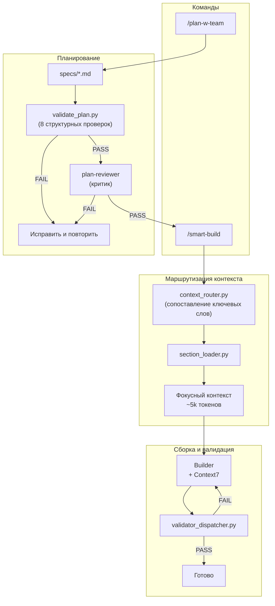

# qwen-code-autocode-flow

[](https://github.com/a-simeshin/qwen-code-autocode-flow/blob/main/README.md)
[](https://github.com/a-simeshin/qwen-code-autocode-flow/blob/main/README.ru.md)
[](https://qwen.ai)
[](https://opensource.org/licenses/MIT)

> Мультиагентный фреймворк автоматизации для **Qwen Code** — портирован из [claude-code-hooks-mastery](https://github.com/a-simeshin/claude-code-hooks-mastery).

## Цель

Сделать работу Qwen Code в агентном режиме **максимально независимой и консистентной** — вы описываете задачу, Qwen Code выдаёт качественный результат, соответствующий вашим ожиданиям.

### Принципы

1. **Автоматизация каждого действия** — если действие существует, оно автоматизировано через LLM (планирование, ревью, валидация, запись знаний)
2. **Контроль через детерминированные скрипты** — все действия управляются жёсткими скриптами, а не решениями LLM (валидаторы, роутеры, диспетчеры)
3. **Запрет на удаление файлов** — деструктивные операции запрещены; хуки обеспечивают это на системном уровне
4. **Документирование в память проекта** — решения и результаты записываются в долгосрочную память на уровне проекта (Serena)
5. **Строгая валидация формата** — структура планов и документации проверяется структурными валидаторами до начала выполнения
6. **Стандарты кода по стеку** — конвенции написания кода и тестов подгружаются в агенты динамически скриптами в зависимости от обнаруженного технологического стека

## Быстрый старт

```bash
curl -fsSL https://raw.githubusercontent.com/a-simeshin/qwen-code-autocode-flow/main/install.sh | bash
```

Устанавливает директорию `.qwen/` с refs, агентами, хуками и валидаторами в текущий проект.

**Зависимости:** Qwen Code, [Astral UV](https://docs.astral.sh/uv/) (ставится автоматически), Node.js, Git

```bash
# Неинтерактивная установка (для CI/автоматизации)
NONINTERACTIVE=1 bash install.sh

# Удаление
rm -rf .qwen
```

## Архитектура



## Возможности

| Возможность | Что делает | Docs |
|-------------|-----------|------|
| **Context Routing** | Маршрутизация по ключевым словам — загружает только нужные refs для задачи, без затрат на LLM | [docs/context-routing.md](docs/context-routing.md) |
| **Plan With Team** | Двухраундовое интервью + каталог маршрутизации секций + стратегия тестирования + 8 проверок валидации | [docs/plan-w-team.md](docs/plan-w-team.md) |
| **Testing Strategy** | Обязательная пирамида тестирования 80/15/5 (unit / integration-API / UI e2e), выделенная задача `write-tests` | [docs/testing-strategy.md](docs/testing-strategy.md) |
| **Plan Review** | Двухэтапный гейт перед сборкой: структурный валидатор + 8-критериальный критик | [docs/plan-review.md](docs/plan-review.md) |
| **Context7** | Опциональный поиск актуальной документации для любой библиотеки через MCP | [docs/context7.md](docs/context7.md) |
| **Serena** | Опциональная семантическая навигация по коду через LSP — поиск символов, ссылок, иерархии типов | [docs/serena.md](docs/serena.md) |
| **Validators** | Умный диспетчер запускает подходящие валидаторы по расширению файла (Java/React/Python) | [docs/validators.md](docs/validators.md) |
| **Status Line** | Контекст, лимиты, инструменты, агенты | [docs/status-line.md](docs/status-line.md) |
| **Install** | Установка одной командой `curl` + неинтерактивный режим для CI | [docs/install.md](docs/install.md) |

## Команды

| Команда | Описание |
|---------|----------|
| `/plan-w-team` | Создать план с интервью и гейтом ревью плана |
| `/smart-build` | Сборка с маршрутизацией контекста и валидацией |
| `/plan` | Быстрый одноагентный план реализации |
| `/all-tools` | Показать все доступные инструменты |

## Структура директорий

```
.qwen/
  hooks/              # Python-скрипты хуков для событий жизненного цикла
    validators/       # 15 валидаторов по типам файлов
    utils/llm/        # Обёртки LLM-клиентов
  agents/             # Конфигурации агентов
    team/             # builder, validator, plan-reviewer
  skills/             # Определения слэш-команд
  refs/               # Стандарты кода (Java, React, Python)
  output-styles/      # Шаблоны формата вывода
  settings.json       # Конфигурация хуков и агентов
specs/                # Планы реализации
logs/                 # Логи выполнения
```

## Покрытие CLAUDE.md / QWEN.md

Flow этого форка **полностью покрывает** четыре поведенческих правила из [andrej-karpathy-skills/CLAUDE.md](https://github.com/forrestchang/andrej-karpathy-skills/blob/main/CLAUDE.md) (Think Before Coding, Simplicity First, Surgical Changes, Goal-Driven Execution) — каждая секция обеспечена автоматическим механизмом, а не отдана на усмотрение LLM.

Совместимо с любым проектом, где в корне лежит свой `QWEN.md` (или `CLAUDE.md`): агент `builder` читает его через `glob("**/QWEN.md")` / `glob("**/CLAUDE.md")` и накладывает поверх этих дефолтов.

| Секция | Чем обеспечена | Степень |
|--------|----------------|---------|
| **§1 Think Before Coding** — допущения, неоднозначности, tradeoffs | `plan-w-team` Interview Round 1 + Round 2 (`AskUserQuestion`); plan-reviewer критерии #1 Problem Alignment, #3 Questions Gap | Сильно — формализованный гейт |
| **§2 Simplicity First** — минимум кода, без спекулятивных абстракций | plan-reviewer критерий #5 Overengineering — явный FAIL | Сильно — гейт |
| **§3 Surgical Changes** — трогать только нужное, без скоупкрипа | plan-reviewer критерий #9 Surgical Scope (до сборки); `check_diff_scope.py` (после сборки, сравнивает git diff с Relevant Files плана) | Сильно — гейт + пост-проверка |
| **§3 Match existing style** | Stack-aware refs автозагружаются `context_router.py` (`refs/*-patterns.md`) + Context7 для актуальных API | Сильно |
| **§4 Goal-Driven Execution** — верифицируемые критерии успеха | `validate_plan.py` требует `## Acceptance Criteria`; `validator_dispatcher.py` запускает ruff/ty/eslint/tsc/spotless на каждом `write_file`/`edit` | Сильно — автоэнфорс |
| **Test Realism** — планы декларируют проверяемую тест-инфраструктуру; сборка проходит layer-check | plan-reviewer критерий #10 Test Realism; `check_test_layers.py` (после сборки, glob + infra signature regex + поиск сценариев + anti-mock эвристика) | Сильно — гейт + пост-проверка |

## MCP-интеграции (опционально)

### [Context7](https://github.com/upstash/context7)

Поиск актуальной документации для любой библиотеки. Когда доступен, агенты builder и validator запрашивают Context7 перед реализацией, чтобы получить актуальные API-ссылки вместо данных из обучения. Покрывает Spring Boot, React, FastAPI и любые другие библиотеки.

### [Serena](https://github.com/oraios/serena)

Семантическая навигация по коду через Language Server Protocol. Когда доступна, все агенты предпочитают символьную навигацию Serena (`find_symbol`, `get_symbols_overview`, `find_referencing_symbols`) вместо Glob/Grep. Также использует `write_memory` / `read_memory` для сохранения архитектурных решений между сессиями.

## Credits

- Портировано из [claude-code-hooks-mastery](https://github.com/a-simeshin/claude-code-hooks-mastery) — [@a-simeshin](https://github.com/a-simeshin)
- Оригинальная концепция от [@disler](https://github.com/disler) ([claude-code-hooks-mastery](https://github.com/disler/claude-code-hooks-mastery))
- Исследования: [ACC-Collab (ICLR 2025)](https://openreview.net/forum?id=nfKfAzkiez), [MAST (ICLR 2025)](https://arxiv.org/abs/2503.13657)

## Лицензия

MIT
